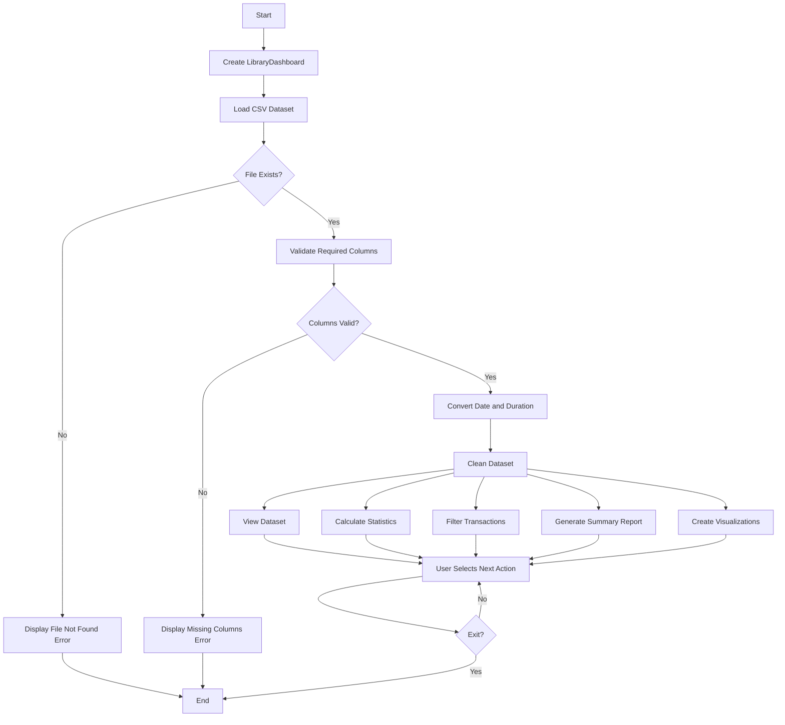
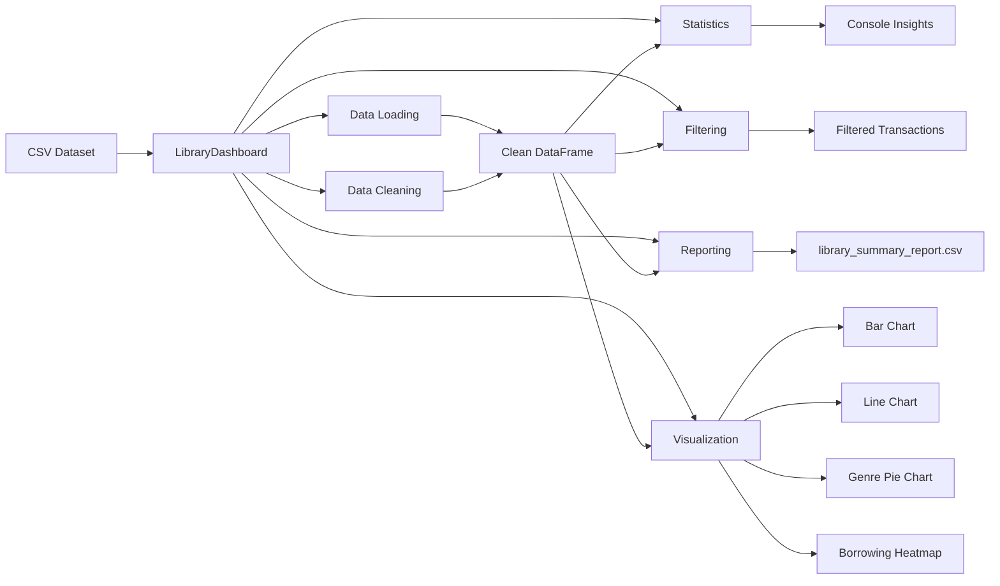
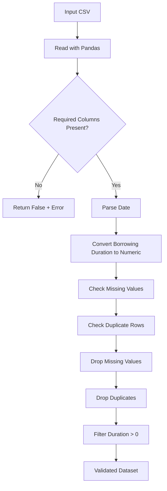
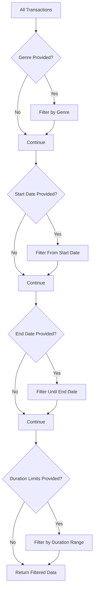
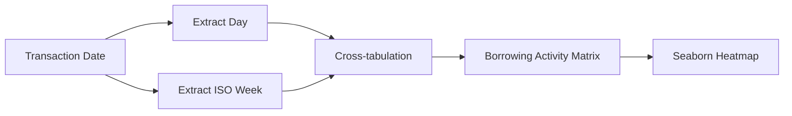
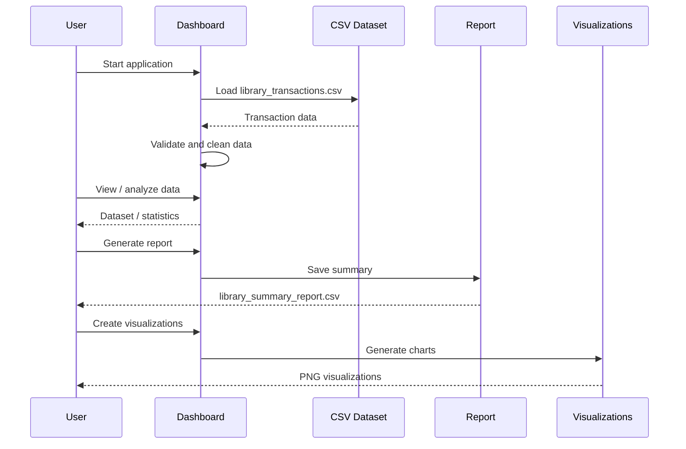
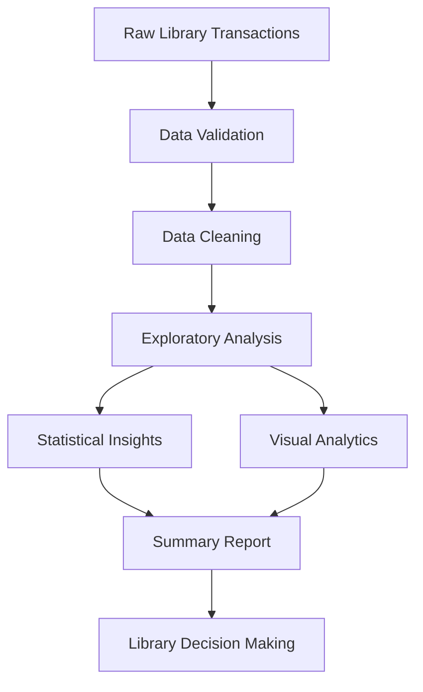

# 📚 E-Library Data Insights Dashboard

A Python-based **E-Library Data Insights Dashboard** for analyzing
library borrowing transactions, generating statistical summaries,
filtering records, exporting reports, and creating visualizations.

> **Project type:** Python Data Analysis / Data Visualization\
> **Core libraries:** Pandas, NumPy, Matplotlib, Seaborn\
> **Primary data source:** `library_transactions.csv`

------------------------------------------------------------------------

## 📌 Table of Contents

-   [Overview](#-overview)
-   [Features](#-features)
-   [Project Workflow](#-project-workflow)
-   [System Architecture](#-system-architecture)
-   [Data Processing Flow](#-data-processing-flow)
-   [Visualizations](#-visualizations)
-   [Dataset Requirements](#-dataset-requirements)
-   [Project Structure](#-project-structure)
-   [Installation](#-installation)
-   [Usage](#-usage)
-   [Generated Outputs](#-generated-outputs)
-   [Important Implementation Notes](#-important-implementation-notes)
-   [Future Improvements](#-future-improvements)
-   [Author](#-author)

------------------------------------------------------------------------

## 🔎 Overview

The E-Library Data Insights Dashboard processes library transaction data
to identify borrowing patterns and produce useful insights.

The implementation uses a `LibraryDashboard` class and supports
operations including:

-   Loading CSV transaction data
-   Validating required columns
-   Converting date and borrowing-duration fields
-   Removing missing and duplicate records
-   Removing invalid non-positive borrowing durations
-   Calculating descriptive statistics
-   Filtering transactions
-   Generating a CSV summary report
-   Creating charts and a borrowing-activity heatmap

The current source code contains both an initial `LibraryDashboard`
implementation and a second `LibraryDashboard` definition with
additional dataset fields. See [Important Implementation
Notes](#-important-implementation-notes).

------------------------------------------------------------------------

## ✨ Features

### 1. Data Loading

The dashboard loads transaction records from a CSV file using Pandas.

``` python
self.df = pd.read_csv(file_path)
```

The source code validates the presence of required columns and converts:

-   `Date` → datetime
-   `Borrowing Duration (Days)` → numeric

------------------------------------------------------------------------

### 2. Data Cleaning

The data-processing logic:

1.  Counts missing values.
2.  Counts duplicate rows.
3.  Removes rows containing missing values.
4.  Removes duplicate rows.
5.  Keeps only records where borrowing duration is greater than zero.

``` text
Raw CSV
   │
   ▼
Load Dataset
   │
   ▼
Validate Columns
   │
   ├── Missing columns ──► Error
   │
   ▼
Convert Data Types
   │
   ▼
Remove Missing Values
   │
   ▼
Remove Duplicates
   │
   ▼
Keep Duration > 0
   │
   ▼
Clean Dataset
```

------------------------------------------------------------------------

## 🔄 Project Workflow



------------------------------------------------------------------------

## 🏗️ System Architecture



------------------------------------------------------------------------

## 🧹 Data Processing Flow

The dashboard performs validation and preprocessing before analysis.



------------------------------------------------------------------------

## 📊 Statistical Analysis

The dashboard calculates:

  -----------------------------------------------------------------------
  Metric                              Description
  ----------------------------------- -----------------------------------
  Most borrowed book                  Book with the highest transaction
                                      count

  Times borrowed                      Number of times the top book was
                                      borrowed

  Average borrowing time              Mean borrowing duration

  Standard deviation                  Variation in borrowing duration

  Minimum duration                    Smallest valid borrowing duration

  Maximum duration                    Largest valid borrowing duration

  Busiest borrowing date              Date with the highest number of
                                      transactions

  Transactions that day               Number of transactions on the
                                      busiest date

  Borrowings by genre                 Number of transactions grouped by
                                      genre

  Average duration by genre           Mean borrowing duration grouped by
                                      genre
  -----------------------------------------------------------------------

The calculations use Pandas and NumPy.

Example:

``` python
durations = np.array(self.df["Borrowing Duration (Days)"])

np.mean(durations)
np.std(durations)
np.min(durations)
np.max(durations)
```

------------------------------------------------------------------------

## 🔍 Transaction Filtering

The filtering logic can apply multiple conditions:

-   Genre
-   Start date
-   End date
-   Minimum borrowing duration
-   Maximum borrowing duration



------------------------------------------------------------------------

## 📈 Visualizations

The source code creates four main visualizations.

### 1. Top 5 Most Borrowed Books

A bar chart displays the five books with the highest borrowing counts.

``` text
Transaction Data
      │
      ▼
Count Book Titles
      │
      ▼
Select Top 5
      │
      ▼
Bar Chart
      │
      ▼
top_5_books.png
```

------------------------------------------------------------------------

### 2. Monthly Borrowing Trends

The line chart groups transactions by month and displays borrowing
activity over time.

``` text
Date
 │
 ▼
Extract Year-Month
 │
 ▼
Group Transactions
 │
 ▼
Monthly Counts
 │
 ▼
Line Chart
 │
 ▼
borrowing_trends.png
```

------------------------------------------------------------------------

### 3. Genre Distribution

A pie chart displays the proportion of borrowing transactions by genre.

``` text
Transactions
     │
     ▼
Count by Genre
     │
     ▼
Calculate Distribution
     │
     ▼
Pie Chart
     │
     ▼
genre_distribution.png
```

------------------------------------------------------------------------

### 4. Borrowing Activity Heatmap

The heatmap combines:

-   Day of the week
-   ISO week number
-   Number of borrowing transactions

The relevant logic is:

``` python
heat["Day"] = heat["Date"].dt.day_name()
heat["Week"] = heat["Date"].dt.isocalendar().week.astype(int)

table = pd.crosstab(heat["Day"], heat["Week"])

sns.heatmap(
    table,
    annot=True,
    fmt="d"
)
```

This produces a matrix where each cell represents borrowing activity for
a particular **day and week**.



------------------------------------------------------------------------

## 🗂️ Dataset Requirements

The source code contains two `REQUIRED_COLUMNS` definitions.

The first implementation expects:

``` text
Transaction ID
Date
User ID
Book Title
Genre
Borrowing Duration (Days)
```

The later implementation expects:

``` text
Transaction ID
User ID
Book ID
Borrow Date
Return Date
Status
Date
Borrowing Duration (Days)
```

For the visualization and statistical methods shown in the source,
fields such as `Book Title` and `Genre` are also referenced.

### Recommended dataset structure

``` text
library_transactions.csv

├── Transaction ID
├── User ID
├── Book ID
├── Book Title
├── Genre
├── Borrow Date
├── Return Date
├── Status
├── Date
└── Borrowing Duration (Days)
```

------------------------------------------------------------------------

## 📁 Project Structure

A recommended project structure is:

``` text
E-Library-Data-Insights-Dashboard/
│
├── library_dashboard.py
├── library_transactions.csv
│
├── library_summary_report.csv
├── top_5_books.png
├── borrowing_trends.png
├── genre_distribution.png
├── borrowing_heatmap.png
│
└── README.md
```

------------------------------------------------------------------------

## ⚙️ Installation

### 1. Clone or download the project

Place the Python script and CSV dataset in your project directory.

### 2. Install dependencies

``` bash
pip install numpy pandas matplotlib seaborn
```

### 3. Verify Python

``` bash
python --version
```

Python 3.x is recommended.

------------------------------------------------------------------------

## ▶️ Usage

Run the Python program:

``` bash
python library_dashboard.py
```

The source code's menu is designed around these operations:

``` text
1. View Dataset
2. Calculate Statistics
3. Filter Transactions
4. Generate Summary Report
5. Create Visualizations
6. Exit
```

### Example workflow



------------------------------------------------------------------------

## 📦 Generated Outputs

### CSV Report

The report contains these metrics:

``` text
Total Transactions
Unique Users
Unique Books
Average Borrowing Duration
Most Borrowed Book
```

Output:

``` text
library_summary_report.csv
```

### Image Outputs

The visualization functions save:

``` text
top_5_books.png
borrowing_trends.png
genre_distribution.png
borrowing_heatmap.png
```

------------------------------------------------------------------------

## 🧩 Main Components

  Component                          Purpose
  ---------------------------------- ----------------------------------
  `LibraryDashboard`                 Main analysis class
  `load_data()`                      Load and validate CSV data
  `show_data()`                      Display first 10 records
  `calculate_statistics()`           Calculate library metrics
  `filter_transactions()`            Filter records using conditions
  `generate_report()`                Create and export summary report
  `create_visualizations()`          Generate visualization set
  `bar_chart_top_books()`            Top-book bar chart
  `line_chart_borrowing_trends()`    Monthly trend chart
  `pie_chart_genre_distribution()`   Genre pie chart
  `heatmap_borrowing_activity()`     Day/week heatmap
  `main()`                           Application entry point

------------------------------------------------------------------------

## ⚠️ Important Implementation Notes

The uploaded source currently contains **two definitions of
`LibraryDashboard`**. In Python, the later class definition replaces the
earlier class definition with the same name.

The source also contains separate visualization methods after the second
`main()` section, while the earlier implementation contains a
`create_visualizations()` method. These sections should be consolidated
into one clean class before treating the script as a final
production-ready application. fileciteturn0file0L152-L190

The original implementation also defines a menu loop, but the uploaded
source excerpt does not show the menu's action-dispatch logic after the
user's choice is read. fileciteturn0file0L178-L191

The visualization methods directly use fields such as `Book Title`,
`Genre`, and `Date`, so the final CSV schema should include the fields
required by the selected analysis functions.
fileciteturn0file0L107-L147

------------------------------------------------------------------------

## 🚀 Future Improvements

Potential improvements for a production-ready version include:

-   Consolidate duplicate `LibraryDashboard` classes.
-   Move all visualization methods inside the dashboard class.
-   Complete the menu's choice-dispatch logic.
-   Add interactive filtering.
-   Add year-aware week handling to the heatmap.
-   Add validation for invalid date ranges.
-   Add logging instead of relying only on `print()`.
-   Add unit tests for data loading, cleaning, filtering, and
    statistics.
-   Add a graphical web interface using Streamlit or another dashboard
    framework.
-   Add KPI cards for total transactions, users, books, and average
    duration.
-   Add export options for filtered datasets.
-   Add documentation for the exact CSV schema.

------------------------------------------------------------------------

## 🧪 Data Quality Rules

The current cleaning logic applies these rules:

``` text
Missing values      → Remove
Duplicate rows      → Remove
Duration <= 0 days  → Remove
Invalid Date        → Converted to NaT and subsequently removed
Invalid Duration    → Converted to NaN and subsequently removed
```

This creates a dataset intended for downstream analysis.

------------------------------------------------------------------------

## 🎯 Project Objective

The main objective of this project is to transform raw library
transaction records into understandable analytical insights.



------------------------------------------------------------------------

## 👨‍💻 Author

**Armin Khareghat**

E-Library Data Insights Dashboard --- Python Data Analysis &
Visualization Project.

------------------------------------------------------------------------

## 📄 License

Add your preferred license here if this project is intended for public
distribution.
