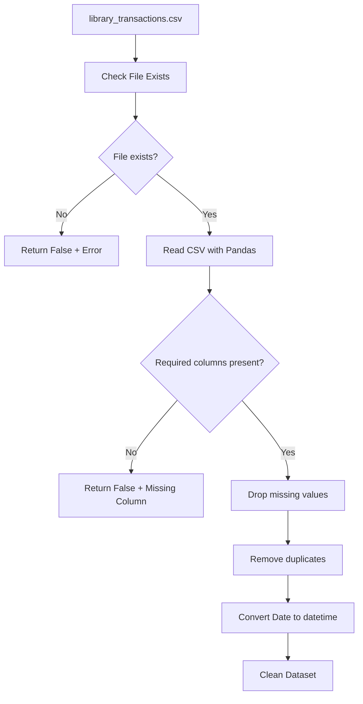
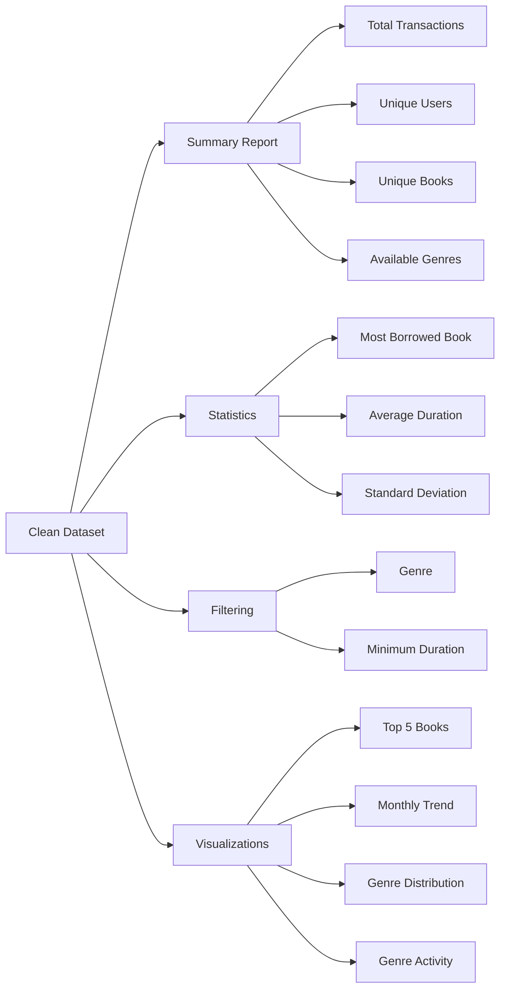
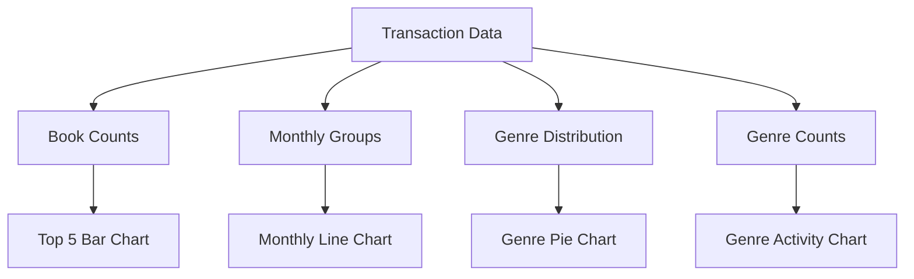
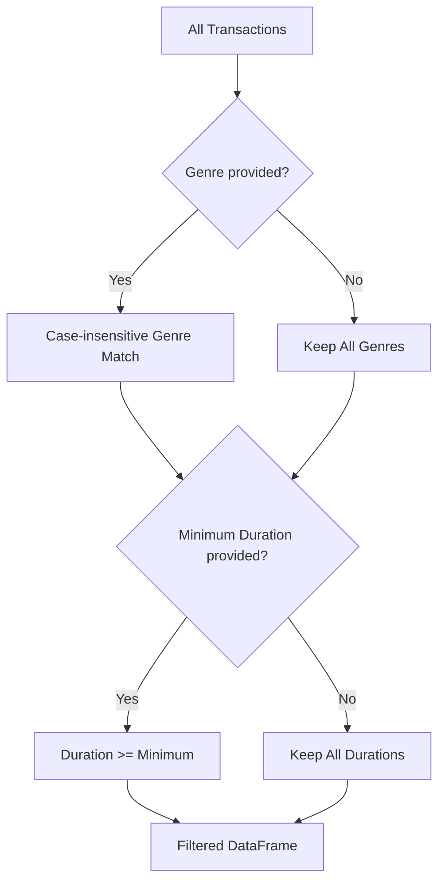
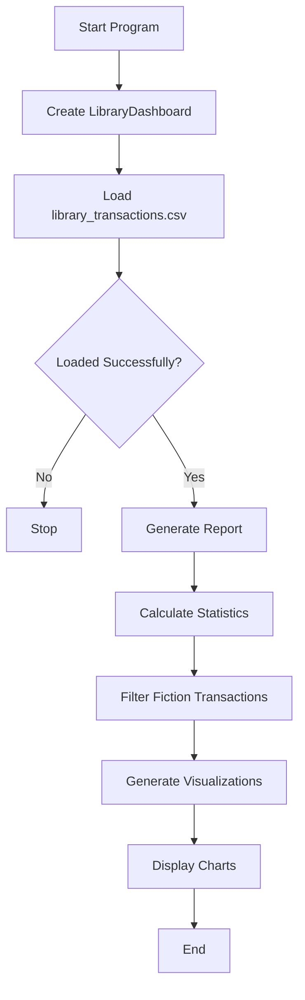

# 📚 E-Library Data Insights Dashboard

A professional Python-based library analytics dashboard that loads, validates, cleans, analyzes, filters, and visualizes library transaction data using **Pandas, NumPy, Matplotlib, and Seaborn**.

> **Project type:** Data Analysis & Visualization  
> **Language:** Python 3  
> **Primary dataset:** `library_transactions.csv`

---

## ✨ Features

- 📥 CSV data loading with file-existence validation
- ✅ Required-column/schema validation
- 🧹 Missing-value and duplicate-row removal
- 📅 Date conversion to Pandas datetime
- 📊 Most borrowed book analysis
- 📐 Average and standard deviation of borrowing duration
- 🔎 Filtering by genre and minimum borrowing duration
- 📋 Summary reporting for transactions, users, books, and genres
- 📈 Four analytical visualizations

---

## 🏗️ Project Architecture

```text
library_transactions.csv
          │
          ▼
   ┌──────────────────┐
   │   load_data()    │
   │ Validate + Clean │
   └────────┬─────────┘
            ▼
      Clean Dataset
       self.df
            │
     ┌──────┼──────┬──────────────┐
     ▼      ▼      ▼              ▼
  Report  Stats  Filters    Visualizations
     │      │      │              │
     └──────┴──────┴──────────────┘
                    ▼
             Library Insights
```

---

## 🛠️ Technologies Used

| Technology | Purpose |
|---|---|
| **Python** | Core programming language |
| **Pandas** | CSV processing, cleaning, grouping, filtering |
| **NumPy** | Numerical statistics |
| **Matplotlib** | Plot rendering |
| **Seaborn** | Statistical visualization and styling |
| **OS** | File-existence validation |

---

## 📂 Project Structure

```text
E-Library-Data-Insights/
│
├── library_dashboard.py
├── library_transactions.csv
└── README.md
```

---

## 📋 Dataset Schema

The dashboard validates these required columns:

| Column | Description |
|---|---|
| `Transaction ID` | Transaction identifier |
| `Date` | Borrowing transaction date |
| `User ID` | Library user identifier |
| `Book Title` | Borrowed book title |
| `Genre` | Book genre |
| `Borrowing Duration (Days)` | Number of borrowing days |

The source code explicitly defines and validates these six expected columns. fileciteturn0file0L20-L25

---

## 🔄 Data Processing Flow



The implementation checks the file, validates the required schema, drops missing and duplicate records, and converts `Date` to datetime. fileciteturn0file0L11-L34

---

## 📊 Analytics Flow



The statistics module calculates the most borrowed title, average duration, and standard deviation using Pandas and NumPy. fileciteturn0file0L41-L58

---

## 📈 Visualization Dashboard

The dashboard creates a **2 × 2 visualization layout** containing four charts. fileciteturn0file0L86-L123

### 1. Top 5 Most Borrowed Books
A bar chart showing the five most frequently borrowed book titles.

### 2. Monthly Borrowing Trends
A line chart showing the number of borrowing transactions grouped by month.

### 3. Genre Distribution
A pie chart showing the distribution of borrowed books across genres.

### 4. Borrowing Activity by Genre
A count-based chart comparing borrowing activity across genres.



---

## 🔎 Filtering Workflow



`filter_transactions()` supports an optional genre filter and an optional minimum borrowing-duration filter. fileciteturn0file0L60-L73

---

## ▶️ Program Execution Flow



The main execution block follows this sequence: create the dashboard, load the CSV, generate the report, calculate statistics, demonstrate a Fiction filter, and generate the charts. fileciteturn0file0L125-L140

---

## 🧩 Main Class & Methods

### `LibraryDashboard`

| Method | Responsibility |
|---|---|
| `__init__()` | Initializes the dashboard and dataset |
| `load_data()` | Loads, validates, cleans, and prepares data |
| `calculate_statistics()` | Calculates borrowing statistics |
| `filter_transactions()` | Filters transactions |
| `generate_report()` | Generates a summary report |
| `generate_visualizations()` | Creates analytical charts |

---

## 🚀 Installation

### 1. Keep the project files together

```text
library_dashboard.py
library_transactions.csv
```

### 2. Install dependencies

```bash
pip install pandas numpy matplotlib seaborn
```

### 3. Run the project

```bash
python library_dashboard.py
```

---

## 📌 Example Output

```text
--- Library Usage Statistics ---
Most Borrowed Book: <book title>
Average Borrowing Duration: <value> days
Standard Deviation of Duration: <value> days
```

The summary report provides:

```text
--- Summary Report ---
Total Transactions: <count>
Unique Users: <count>
Unique Books: <count>
Genres Available: <genre list>
```

The actual values depend on the supplied CSV dataset and are intentionally not hard-coded in this README.

---

## 🧹 Data Quality Pipeline

```text
File Validation
      ↓
Column Validation
      ↓
Missing-Value Removal
      ↓
Duplicate Removal
      ↓
Date Conversion
      ↓
Clean Dataset
      ↓
Analysis & Visualization
```

These data-cleaning operations are implemented inside `load_data()`. fileciteturn0file0L27-L39

---

## 💡 Analytical Questions

This project can answer questions such as:

- Which books are borrowed most frequently?
- How does borrowing activity change month by month?
- Which genres are most popular?
- What is the average borrowing duration?
- How much variation exists in borrowing duration?
- How many unique users and books are represented?
- Which transactions satisfy a selected genre or duration condition?

---

## ⚠️ Notes & Limitations

- The CSV must contain all required columns.
- Missing and duplicate records are removed during loading.
- The `Date` column must contain values convertible to datetime.
- The current dashboard uses Matplotlib/Seaborn and displays charts through `plt.show()`.
- The example execution filters for the `Fiction` genre.

---

## 🔮 Future Improvements

- Add an interactive Streamlit or Plotly dashboard
- Add date-range filters
- Add user-level borrowing analysis
- Add overdue-return analysis
- Export reports to Excel/PDF
- Add automated data-quality summaries
- Add interactive borrowing heatmaps
- Add unit tests and structured logging
- Add configurable dataset paths

---

## 📄 Project Summary

```text
LOAD
  ↓
VALIDATE
  ↓
CLEAN
  ↓
ANALYZE
  ↓
FILTER
  ↓
VISUALIZE
  ↓
INSIGHT
```

**E-Library Data Insights Dashboard** provides an end-to-end foundation for converting raw library transaction data into useful analytical insights with Python.
